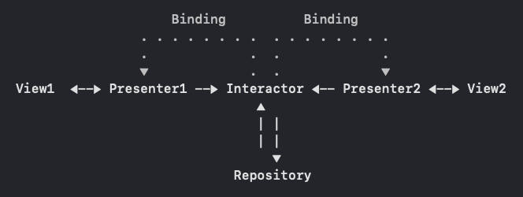

# #мамавыдохни: трекер
#### Модуль проекта [#мамавыдохни](https://github.com/4440449/Mom_Exhale)

## Tech spec
- MVP + R + I(State + Actions). Элементы Clean architecture
- Каждый экран выделен в отдельную сцену со своим окружением (Configurator, Presenter, Router)
- Interactor в качестве общего State для приложения
- UI - UIKit Storyboard
- Навигация через Storyboard segues + Router
- Generic подход при работе с TableView (одновременно используются разныме типы данных закрытые одним протоколом)
- [Переиспользуемая сцена](https://github.com/4440449/BabyTrackerWW/blob/master/BabyTrackerWW/PresentationLayer/Scenes/Picker/ViewModel/PickerSceneViewModel_BTWW.swift)
- [Кастомный Task management](https://github.com/4440449/BabyTrackerWW/blob/master/BabyTrackerWW/PresentationLayer/Interactor/RepositoryTask.swift) через обертку над URLSessionTask
- Observing через [собственную библиотеку](https://github.com/4440449/MommysEye)
- Network через [собственную библиотеку](https://github.com/4440449/BabyNet)
- Backend - JSON Patch Api (подробнее ниже в разделе `Feature`)
- Local storage - Core data
- XCTests на логику Data слоя
- Dark mode
- Custom navigation transition

## Features  
* Поток данных **по схеме:**  
              
    1. Cвязь Presenter - View по классической схеме 'запрос-ответ', через протоколы Input-Output;
    2. Обратная свзять Interactor - Presenter через обычный биндинг;
    3. Помимо состояния Interactor держит репозиторий и осуществляет все взаимодействие с ним; 
    4. При навигации Interactor шарится на следующие сцены в виде инкапсулированного протоколом объекта (у каждый сцены свой протокол);
               
* Работа с бэкендом построена на *JSON Patch API*  
Решение обсуловлено тем, что бизнес логика подразумевает редактирование таблицы сразу нескольких сущностей в единой операции, по схеме - ``Редактирование - Принять изменения / Отменить изменения``. Что приводит к необходимости использования массовых CRUD операций (+ т.к. таблица дженерик, взаимодействие идет еще и с разными репозиториями). Решение позволяет выполнять единый запрос с заголовком в соостветствии с Patch API 'add' / 'remove' / 'replace' и т.д.  
BaaS с такой возможностью на момент написания кода не нашел, поэтому реализация осталась только на клиентской стороне.
            
* DTO  
Для работы в репозитории выделены отдельные сущности с необходимым для осуществления локальной логики пулом параметров.
        
* Финальный продукт [запакован в SPM](https://github.com/4440449/BabyTrackerModule) и инъектися в основной проект, как обычный пакет.  
Практически вся реализация модуля остается приватной для изменений и вызовов из основного проекта. Точка входа - Bundle пакета, из которого достается Storyboard по соответствующему ключу. 
    
        
## TODO 
- Backend на JSON Patch api   
- In app handling dark mode

# HOW TO USE APP

# MARKETING 
